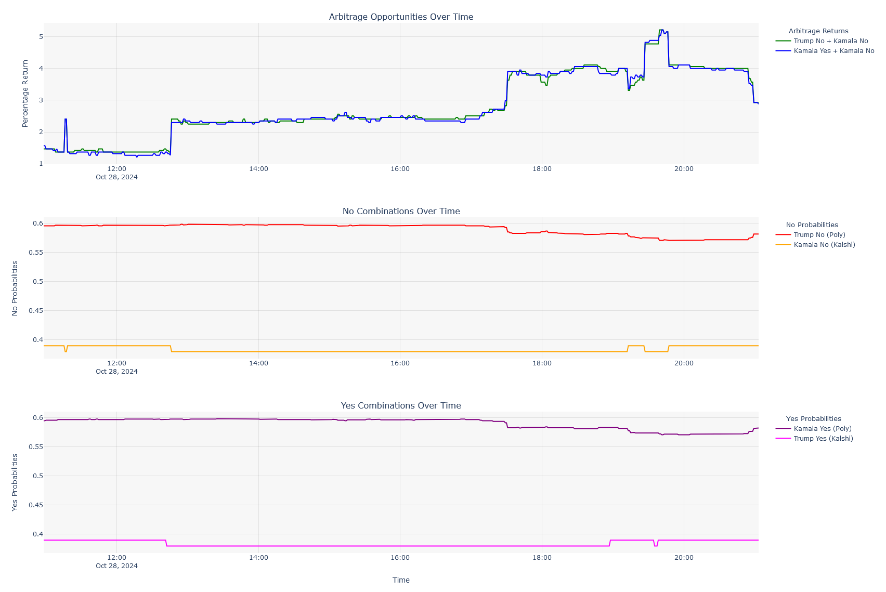

# 
Cross-Platform Arbitrage Detection Tool

## Overview

They say looking for arbitrage is like looking for Bigfoot. For the most part that is true. Event contracts on platforms like Kalshi and Polymarket offer a rare exception. This tool provides a way to identify, monitor, and exploit arbitrage opportunities across prediction markets.

## Performance
Within one day of monitoring event contracts for the popular vote of the 2024 presidential election, I have identified opportunities yielding up to 5.2% that will be realized in 9 days. (Today is Oct 28, 2024 and the election is Nov 5, 2024). If this could be done repeatedly, the annualized return would be:

$\text{Annualized Return}$ = $(1 + \text{Cumulative Return})^{\frac{365}{\text{Days Held}}} - 1$

$\text{Annualized Return}$ = $(1 + \text{.052})^{\frac{365}{\text{9}}} - 1$

$\text{Annualized Return}$ = 681.38%

Note that doing this repeatedly would require having a constant stream of logically equivalent, inefficiently priced contracts across platforms. Presidential elections only happen once every 4 years, but there are other economic events with associated contracts that occur far more frequently (and are also inefficiently priced).

<b>Disclaimer:</b> Not financial advice. While arbitrage is mathematically risk-free, there is still platform and governance risk since these are emerging markets.

## The Math

The implied probability of Kamala Harris winning the popular vote on Polymarket is currently 58%, but it is 63% on Kalshi. There are currently no fees for purchasing contracts on either platform.

Since there are different implied probabilities for the same events across platforms, the market is inefficient. This can be exploited by taking opposing positions on different platforms and profiting a risk-free return of the difference regardless of the outcome.

### Kamala Yes/No Spread Example:
* Bet "Yes" on Kamala to win on Polymarket @ 58.4 cents
* Bet "No" on Kamala to win on Kalshi @ 38 cents
* The total cost of both trades is 96.4 cents, but the payoff for either outcome is $1.
* (1 - .964) / .964 = 3.73%

### Kamala/Trump No Spread Example:
* Bet "No" on Trump to win on Polymarket @ 58.5 cents
* Bet "No" on Kamala to win on Kalshi @ 38 cents
* Total cost: 96.5 cents
* (1 - .965) / .965 = 3.63%

## Repository Description

The numbers in the examples above are constantly changing. By connecting to the APIs of both Kalshi and Polymarket, we can track these numbers throughout the day.

### Files

* The notebook file explores the data that comes from the APIs and establishes a proof-of-concept for the arbitrage strategy.

* The monitor file connects to the APIs and updates a CSV file with the latest prices and the associated arbitrage opportunities.

* The plot file reads the CSV file and creates a Plotly chart (arbitrage_plot.html) to visualize the changes in these numbers over time (screenshot below).

